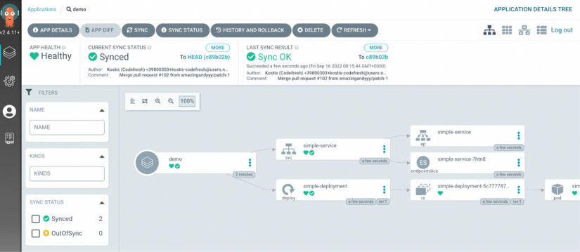

---
title: Gitops
--- 

# GitOps ve Argo CD
## Selamlar, GitOps prensibi ve bir GitOps aracı olan ArgoCD  hakkında öğrenim senaryosudur. 

###  Seviye: Başlangıç

## Neden GitOps?

Günümüzde hızla değişen ve genişleyen yazılım geliştirme dünyasında, dinamik bir yapıda olmak ve yeniliklere adapte olmak oldukça önemli. Zaman içerisinde, ihtiyaçları hızlı karşılayamadığımız Waterfall modelinden Agile’a geçiş yaptık. Daha küçük değişikliklerle, küçük iterasyonlarla hedefi yakalamaya başladık. Bu çevik yapının içinde, sürekli değişimleri karşılamak adına operasyon ve geliştirme takımlarının iç içe geçtiği devops kültürünü oluşturduk. Günümüz modern dünyasında ise daha büyük challengelar ile başbaşayız. Containerization’ın yaygınlaşması, Kubernetes’in hayatımıza girmesiyle beraber, herhangi bir Git reposu üzerinde tutulan uygulamaların bu Kubernetes cluster ları üzerine merkezi bir yerden deploy olması ve yönetilmesi bunlardan biri. GitOps’a bu yüzden ihtiyaç duyuyoruz.

## GitOps Nedir?

Genel bir tanımla; GitOps, versiyon kontrol, işbirliği, uyumluluk ve CI/CD araçları gibi uygulama geliştirme için kullanılan DevOps best practice'lerini alan ve bunları altyapı otomasyonuna uygulayan operasyonel bir çerçevedir.

## Argo CD Nedir?

Argo CD; Kubernetes için bildirime dayalı, GitOps metodolojisini izleyen bir sürekli teslim aracıdır.

“Uygulama tanımları, konfigürasyonları ve ortamları bildirime dayalı ve versiyon kontrollü olmalıdır” mantığı ile çalışır. Uygulama dağıtımı ve yaşam döngüsü yönetiminin otomatikleştirilmiş, denetlenebilir ve anlaşılabilir olmasını sağlar.

## Argo CD Nasıl Çalışır?

Argo CD belirli periyotlarda Kubernetes’e deploy edilmiş uygulamaları izler ve Git reposunda yer alan tanım dosyalarıyla karşılaştırmalar yapar. Herhangi bir farklılık durumunu kullanıcıyı bildirir ya da belirtilirse otomatik olarak senkronizasyon işlemini gerçekleştirir.

## Neden Argo CD ?

+ Kubernetes cluster'ınızı görselleştirir. Yani bir deployment inizi replica set,pod vb.kuberetes objeleri şeklinde görselleştiriyor.
+ Helm, customize, yaml tanım dosyalarını destekliyor.
+ Birden fazla kubernetes cluster ile entegre edilebiliyor.
+ İmperative bir şekilde kubectl kullanmıyorsunuz, yapınızı declarative yapıyorsunuz yani yaptığınız değişikliği Argo CD algılayıp Kubernetes’e yüklenmesini sağlıyor.
+ Kubernetes cluster'ınızda bir deployment silindi veya bir kesinti yaşadınız; Argo CD hem git reposu hem Kubernetes'i sürekli monitor ettiğinden ikisi arasında fark olduğunu anlayıp silinen deployment'ı tekrar yerine getirebiliyor.

## Öğrenme Hedefleri

GitOps senaryosunu tamamladıktan sonra;

+ GitOps prensibinin ne olduğu,
+ ArgoCD aracının ne işe yaradığıu ve nasıl kurulduğu hakkında bilgi sahibi olacaksınız.

## Ön gereksinimler

+ Linux dağıtımlarından en az birine aşina olmalı ve kullanabiliyor olmalısınız.
+ Docker ve podman gibi container araçlarını kullanabiliyor olmalısınız.
+ Kubernetes container orkestrasyonu hakkında bilgi sahibi olmalısınız.

## Senaryo 1

+ Argo CD Kurulumu

Uygulamaları dağıtabilmemizi sağlayan Argo CD aracını clusterımıza yükleyelim. Halihazırda Kubernetes kurulu ortamımızda aşağıdaki adımları izleyerek Argo CD kurabiliriz.

Öncelikle argocd isminde bir namespace oluşturalım. `kubectl create namespace argocd`

`kubectl apply -n argocd -f https://raw.githubusercontent.com/argoproj/argo-cd/stable/manifests/install.yaml` komutu ile Argo CD GitHub sayfasında yer alan tanım dosyaları ile kurulumu gerçekleştirebiliriz.

`kubectl get all -n argocd` komutu ile Argoocd namespace'inde oluşturulan objeleri listeleyelim.

Varsayılan olarak Argo CD API sunucusu harici bir IP ile ile expose edilmez. Bunun için port-forwarding ile API Server'a bağlanacağız.

`kubectl port-forward svc/argocd-server -n argocd 8080:443`

Artık API Server'a https://localhost:8080 üzerinden erişilebilir. Gidip ArgoCD arayüzü ile tanışma zamanı!

Admin hesabının ilk parolası otomatik olarak oluşturulur ve Argo CD kurulum ad alanınızda argocd-initial-admin-secret adlı bir gizli alan parolasında açık metin olarak saklanır. Bu şifreyi kubectl kullanarak kolayca alabilirsiniz. Başka bir terminal tab'ı içerisinde aşağıdaki komutu çalıştırın.

`kubectl -n argocd get secret argocd-initial-admin-secret -o jsonpath="{.data.password}" | base64 -d; echo`

Artık kullanıcı admin olan Argocd hesabının password bilgisine sahipsiniz. Bu bilgiler ile https://localhost:8080 adresinden ArgoCD'ye giriş sağlayabilirsiniz.

Bizleri aşağıdaki gibi bir Argo CD arayüzü karşılıyor olacak!

## Senaryo 2

+ Argo CD Üzerinde Uygulama Oluşturma

Merhabalar, Kubernetes ortamı üzerinde Argo CD kurulumumuzu tamamladığımıza göre artık ilk Argo CD uygulamamızı deploy edebiliriz.

Argo CD arayüzü üzerinde bir uygulama oluşturmak için "+New App" butonuna tıklanır. Açılan pencere üzerinden uygulama bilgileri doldurulur. Bu örnekte Codefresh'in örnek reposundaki bir uygulamayı deploy edeceğiz. 

Aşağıda açılan pencere üzerinde uygulama bilgilerini girelim:

Son durumda Appliation bilgileri aşağıdaki gibidir:

+ application name : `demo`
+ project: `default`
+ sync policy: `manuel`
+ repository URL: `https://github.com/aycakcayy/gitops-certification-examples`
+ path: `./simple-app`
+ Cluster: `https://kubernetes.default.svc` 
+ namespace: `default`

Diğer parametreleri boş bırakarak Create butonuna tıkladığımızda demo uygulamamız aşağıdaki şekilde oluşur.

Argo CD bizlere uygulamamızı otomatik veya manuel şekilde sync etme seçeneği sunar. Şanki uygulamamızda sync durumu manuel olacak şekilde bir seçim yaparak ilerledik. Yani biz manuel olarak tetiklemediğimiz sürece uygulama sync durumuna geçmeyecektir.

Uygulama şuanda OutOfSync durumundadır. Bunun anlamı;

+ Cluster boş,
+ Git reposunda bir uygulama var,
+ Bu nedenle Git durumu ve cluster durumu farklıdır. Git reposu ve cluster sync durumda değildir. (OutOfSync)

Ayrıca CLI’da aşağıdaki komutu çalıştırarak herhangi bir deployment oluşmadığını da görebiliriz.

`kubectl get deployments` 

Application’ı oluştururken sync policy parametresini manuel olarak seçtiğimiz için, sync butonuna basarak uygulamayı manuel olarak tetiklemeliyiz. Sync olduktan sonra uygulamamız içine girdiğimizde aşağıdaki şekilde gözükecektir.

Tüm kalper yeşil! Uygulamamız başarıyla deploy oldu!

Tekrar `kubectl get deployments` dediğimizde oluşan uygulamamızı artık görüntüleyebiliriz.

Burada aynı zamanda Argo CD arayüzü sayesinde görselleştirilmiş bir cluster görebiliyoruz. Demo uygulamamızda yer alan,
replicaset, endpoint, pod objelerini görüntüleyebiliyoruz. Uçtan uca görselleştirilmiş bir deployment!

Arayüz üzerinden “delete” butonuna basarak uygulamayı silip, demo çalışmasını bitirebiliriz. 

## Senaryo 3

+ Senkronizasyon Stratejileri

Senaryoda sırasında şunları öğreneceksiniz:

+ AutoSync nedir ve nasıl kullanılır?
+ SelfHeal nedir ve nasıl kullanılır?
+ AutoPrune nedir ve nasıl kullanılır?

Bu senaryoda Argo CD'nin senkronizasyon stratejileri ile ilgili bir demo gerçekleştireceğiz. Öncelikle yine aynı REPO URL'i üzerinden ./sync-strategies path'i altındaki uygulmamaızı Argo CD üzerine deploy edelim.

Bunun için Argo CD arayüzünde "new app" diyerek açılan pencere üzerinde uygulama bilgilerini aşağıdaki şekilde dolduralım.

+ application name : `demo`
+ project: `default`
+ sync policy: `automotic`
+ repository URL: `https://github.com/aycakcayy/gitops-certification-examples`
+ path: `./sync-strategies`
+ Cluster: `https://kubernetes.default.svc` 
+ namespace: `default`

Diğer parametreleri boş bırakarak Create butonuna tıkladığımızda demo uygulamamız aşağıdaki şekilde oluşur.

Senkronizasyon stratejisini otomatik olarak seçtiğimiz için, Argo CD, uygulamayı hemen otomatik olarak deploy etti.(çünkü cluster durumu, repo durumuyla aynı değildi ve otomatik olarak hemen senkronize oldu)

`kubectl get deployments` diyerek oluşan uygulamayı da CLI üzerinden kontrol edebiliriz.

+ AutoSync ile yeni versiyonu deploy edelim!

Uygulamamızın başka bir versiyonunu deploy etmek istiyoruz. Git'i değiştireceğiz ve Argo CD'nin değişikliği nasıl algıladığını ve otomatik olarak dağıttığını göreceğiz (senkronizasyon stratejisini otomatik olarak ayarladığımız için)

Git repomuz üzerindeki sync-strategies/deployment.yml dosyasında 18.satırdaki versiyon bilgisini `v1.0`'den  `v2.0` olacak şekilde güncelliyoruz.

Normalde Argo CD, Git ile cluster arasındaki durumu her 3 dakikada bir default olarak kontrol eder. İşleri hızlandırmak için Argo CD arayüzündeki uygulamaya manuel olarak tıklamalı ve "Refresh" butonuna basmalısınız.

Uygulamanın arayüzüne giderek, uygulama versiyonunun artık V2 olduğunun görebiliriz.

+ SelfHeal Stratejisi

Autosync, Git reposu değişir değişmez uygulamanızı otomatik olarak dağıtır. Ancak biri cluster durumunda manuel bir değişiklik yaparsa, Argo CD varsayılan olarak hiçbir şey yapmaz (uygulamayı yine de senkronizasyon dışı-outofsync- olarak işaretler).

Argo CD'ye clusterda manuel olarak yapılan değişiklikleri atmasını söylemek için "SelfHeal" seçeneğini etkinleştirebilirsiniz. Bu, deployment ortamınızı dışardan manuel olarak müdahele edilemez hale getirir. Daha önce de değindiğimiz gibi; deployment için tek gerçek kaynak Git reponuzdur. 

Örneğin CLI üzerinde aşağıdaki komutu çalıştırın. `kubectl scale --replicas=3 deployment simple-deployment` Bu şekilde manuel olarak cluster üzerinde değişiklik yaptınız.

Şimdi Argo CD arayüzüne gidin ve uygulamaya tıklayın. Uygulama ekranında sol üstteki "App Details" kısmına geçin.

"Sync Policy" kısmında yer alan "Self Heal" seçeneğini enable durumuna geçirin. Onay iletişim kutusuna tamam yanıtını verin.

Artık uygulamadaki manuel yapılan değişikler devredışı bırakılır ve replica sayısı da 1'e döner. (Git reposunda belirtilen şekilde.)

Artık kümedeki herhangi bir şeyi değiştirmeyi deneyebilirsiniz ve tüm değişiklikler her zaman atılır (Git'in parçası olmadıkları için)

CLI üzerinde tekrardan `kubectl scale --replicas=3 deployment simple-deployment` diyerek replica sayısını 3'e çekelim. Ardından hemen `kubectl get deployment simple-deployment` dediğimizde uygulamanın tek podu olduğunu göreceğiz.

Uygulamanız her zaman dağıtılmış 1 pod'a sahip olacaktır. Git durumu bunu söylüyor ve bu nedenle Argo CD otomatik olarak küme durumunu aynı hale getiriyor ve manuel değişiklikleri devre dışı bırakıyor olacak.

+ AutoPrune Stratejisi

AutoSync ve AutoHeal etkinleştirdikten sonra bile, Git'te kaynakları kaldırırsanız, Argo CD kaynakları clusterdan yine de silmez.

Bu davranışı etkinleştirmek için AutoPrune seçeneğini etkinleştirmeniz gerekir.

İlk olarak Git reposunda sync-strategies/deployment.yml dizinine giderek bu deployment dosyasını silin ve commit edin.

Ardından ArgoCD arayüzünde "Refresh" butonuna tıklayın. ArgoCD, değişikliği algılayacak ve uygulamayı "OutOfSync" olarak işaretleyecektir. Ancak deployment hala orada olacak.

Şimdi bu durumu düzeltmek için, Argo CD dashboarda gidelim. Uygulamanın içine girip "App details" kısmından "Prune resources" seçeneğini enable hale getirelim. Enable butonuna tıklayıp, onaylayalım.

Ayarlar kısmını kapatıp uygulamayı "refresh" ettiğimizde deployment artık cluster üzerinden kaldırılacak.

CLI üzerinde komut ile de kontrol ettiğimizde `kubectl get deployment` artık deployment cluster üzerinden kaldırılmış durumdadır.

Tebrikler, tüm adımları tamamladınız! Demo uygulamasını silip, senaryoyu bitirebilirsiniz.

